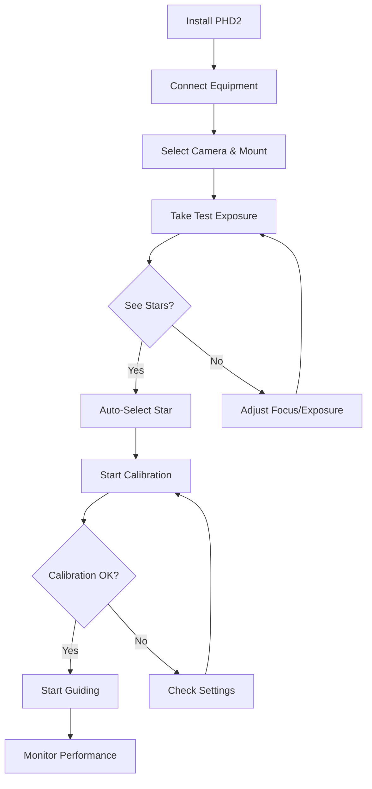

# Getting Started with PHD2

Welcome to PHD2! This guide will help you get started with telescope guiding quickly and easily.

## Overview

PHD2 is designed to make telescope guiding as simple as possible. Whether you're a beginner taking your first astrophotographs or an experienced imager, PHD2 provides the tools you need for accurate guiding.

## What You'll Need

### Hardware Requirements

- **Guide Camera**: Any supported camera (see [Camera Support](equipment/cameras.md))
  - Dedicated guide camera (recommended)
  - Main imaging camera with guide camera port
  - Planetary camera adapted for guiding
  
- **Mount**: A motorized equatorial mount with:
  - ASCOM/INDI driver support, OR
  - ST-4 compatible guiding port

- **Guide Scope or Off-Axis Guider (OAG)**:
  - Small guide scope (50-100mm recommended)
  - Off-axis guider attachment
  - Adaptive optics unit (advanced)

- **Computer**:
  - Windows 10/11, macOS 11+, or Linux
  - USB ports for camera connection
  - Minimum 4GB RAM recommended

### Software Requirements

- **PHD2** (latest version)
- **Camera Drivers**:
  - ASCOM Platform (Windows)
  - INDI server (Linux/macOS)
  - Native SDK drivers (auto-installed)
- **Mount Drivers**: ASCOM/INDI compatible

## Installation Guide

Choose your platform:

-   :fontawesome-brands-windows:{ .lg .middle } **Windows**

    ---

    Install PHD2 on Windows 10/11

    [:octicons-arrow-right-24: Windows Guide](installation/windows.md)

-   :fontawesome-brands-apple:{ .lg .middle } **macOS**

    ---

    Install PHD2 on macOS (Intel & Apple Silicon)

    [:octicons-arrow-right-24: macOS Guide](installation/macos.md)

-   :fontawesome-brands-linux:{ .lg .middle } **Linux**

    ---

    Install PHD2 on Linux (Ubuntu, Fedora, Debian)

    [:octicons-arrow-right-24: Linux Guide](installation/linux.md)

## First Steps

After installation, follow these steps:

### 1. Connect Your Equipment

Connect your guide camera and mount to your computer. Make sure all drivers are installed and working.

[:octicons-arrow-right-24: Equipment Connection Guide](../user-guide/basic/connecting.md)

### 2. Configure PHD2

Launch PHD2 and select your camera and mount from the connection dialog.

[:octicons-arrow-right-24: Configuration Guide](configuration.md)

### 3. Run First Light

Point your telescope at a star field and take your first guide exposure.

[:octicons-arrow-right-24: First Light Tutorial](first-light.md)

### 4. Calibrate

PHD2 needs to calibrate your mount's guiding response.

[:octicons-arrow-right-24: Calibration Guide](../user-guide/basic/calibration.md)

### 5. Start Guiding

With calibration complete, you're ready to guide!

[:octicons-arrow-right-24: Start Guiding](../user-guide/basic/starting-guiding.md)

## Quick Start Path

For the fastest path to successful guiding:

## Learning Resources

### Documentation

- **[Quick Start](quickstart.md)**: 5-minute guide to first light
- **[First Light Tutorial](first-light.md)**: Detailed walkthrough
- **[User Guide](../user-guide/index.md)**: Complete reference
- **[Tutorials](../tutorials/index.md)**: Step-by-step guides

### Video Tutorials

!!! tip "Video Resources"
    Check out video tutorials on the PHD2 website and community channels for visual guides to setup and configuration.

### Community Support

- **[PHD2 Forum](https://groups.google.com/forum/#!forum/open-phd-guiding)**: Ask questions and share experiences
- **[GitHub Discussions](https://github.com/OpenPHDGuiding/phd2/discussions)**: Technical discussions
- **IRC**: #phd2 on Libera.Chat

## Common First-Time Issues

??? question "Can't see any stars"
    **Solutions:**
    - Increase exposure time (try 2-5 seconds)
    - Check focus (stars should be sharp, not blurry)
    - Remove lens cap (it happens!)
    - Check camera connection
    - Verify camera is cooling if using cooled camera

??? question "Calibration fails"
    **Solutions:**
    - Ensure mount tracking is ON
    - Point at equator (Dec=0) for best results
    - Avoid stars near pole (Dec > 70°)
    - Check calibration step size (3-5 arc-seconds recommended)
    - Verify mount responds to guide commands

??? question "Guiding is erratic"
    **Solutions:**
    - Run Guiding Assistant for recommendations
    - Check for cable snags or mechanical issues
    - Verify mount is balanced
    - Adjust algorithm aggressiveness
    - Ensure good polar alignment

[More Troubleshooting →](../user-guide/troubleshooting.md)

## What's Next?

Once you have basic guiding working:

1. **Optimize Performance**: Use the [Guiding Assistant](../user-guide/tools/guiding-assistant.md)
2. **Learn Advanced Features**: Explore [Advanced Settings](../user-guide/advanced/settings.md)
3. **Try Different Algorithms**: Compare [Guide Algorithms](../user-guide/advanced/algorithms.md)
4. **Enable Dithering**: Learn about [Dithering & Settling](../user-guide/advanced/dither.md)
5. **Automate**: Set up [API Control](../api-reference/index.md)

## Need Help?

- 📖 **[User Guide](../user-guide/index.md)**: Comprehensive documentation
- 🎓 **[Tutorials](../tutorials/index.md)**: Step-by-step guides
- ❓ **[FAQ](../reference/faq.md)**: Frequently asked questions
- 🐛 **[Troubleshooting](../user-guide/troubleshooting.md)**: Common problems and solutions
- 💬 **[Community Support](../about/contact.md)**: Forums and chat

---

Ready to get started? [Install PHD2 now →](installation/windows.md){ .md-button .md-button--primary }
