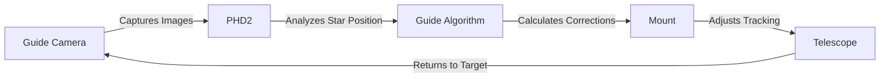
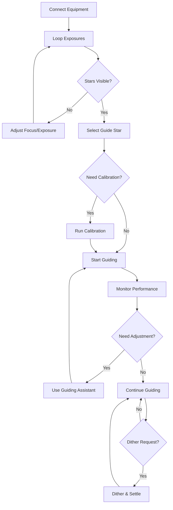

# User Guide

Welcome to the PHD2 User Guide. This comprehensive guide covers everything you need to know to use PHD2 effectively for telescope guiding.

## What is PHD2?

PHD2 is telescope guiding software that provides precise tracking corrections to your mount during long-exposure astrophotography. It continuously monitors a guide star and sends correction signals to keep your telescope accurately pointed at your target.

## How PHD2 Works

1. **Capture**: Guide camera takes repeated exposures
2. **Detect**: PHD2 identifies and tracks guide star position
3. **Analyze**: Algorithm calculates position error
4. **Correct**: Sends guide pulses to mount
5. **Repeat**: Continuously monitors and corrects

## Guide Organization

### Basic Usage

Start here if you're new to PHD2:

- **[Main Screen](basic/main-screen.md)**: Understanding the interface
- **[Connecting Equipment](basic/connecting.md)**: Camera and mount setup
- **[Starting Guiding](basic/starting-guiding.md)**: Your first guiding session
- **[Calibration](basic/calibration.md)**: Understanding and performing calibration

### Advanced Topics

Once you're comfortable with basics:

- **[Guide Algorithms](advanced/algorithms.md)**: Choosing and tuning algorithms
- **[Advanced Settings](advanced/settings.md)**: Fine-tuning PHD2 behavior
- **[Dark Frames & Bad Pixel Maps](advanced/darks-defects.md)**: Improving image quality
- **[Dithering & Settling](advanced/dither.md)**: Integration with imaging software
- **[Multi-Star Guiding](advanced/multistar.md)**: Using multiple guide stars

### Equipment

Equipment-specific information:

- **[Camera Support](equipment/cameras.md)**: Supported cameras and configuration
- **[Mount Support](equipment/mounts.md)**: Mount connection options
- **[Adaptive Optics](equipment/ao.md)**: AO unit integration
- **[Auxiliary Mounts](equipment/aux-mount.md)**: Dual-mount configurations

### Tools

Built-in tools and utilities:

- **[Guiding Assistant](tools/guiding-assistant.md)**: Automated performance analysis
- **[Manual Guide](tools/manual-guide.md)**: Manual guiding controls
- **[Comet Tracking](tools/comet-tracking.md)**: Non-sidereal tracking
- **[Star Profile & Cross Test](tools/star-tools.md)**: Optical analysis tools
- **[Log Analysis](tools/log-analysis.md)**: Reviewing guiding performance

### Reference

Quick reference materials:

- **[Visualization](visualization.md)**: Understanding graphs and displays
- **[Troubleshooting](troubleshooting.md)**: Common problems and solutions
- **[Keyboard Shortcuts](keyboard-shortcuts.md)**: Productivity tips
- **[Glossary](glossary.md)**: Technical terms explained

## Key Concepts

### Guide Star Selection

PHD2 can automatically select guide stars or you can choose manually:

- **Automatic**: Click "Auto-select Star" for intelligent selection
- **Manual**: Click directly on your preferred star
- **Multi-Star**: Enable for tracking multiple stars simultaneously

### Calibration

Before guiding, PHD2 must calibrate to learn your mount's response:

- **When**: Required after equipment changes or large mount movements
- **Where**: Point near celestial equator (Dec ≈ 0°) for best results
- **Duration**: Typically 1-2 minutes
- **Result**: Determines mount movement rates and angles

### Guide Algorithms

PHD2 offers several algorithms for different conditions:

| Algorithm | Best For | Characteristics |
|-----------|----------|-----------------|
| **Hysteresis** | General use | Simple, predictable, minimal corrections |
| **Lowpass** | Seeing rejection | Filters high-frequency errors |
| **Lowpass2** | Better seeing rejection | More aggressive filtering |
| **Resist Switch** | Avoiding oscillation | Resists direction changes |
| **Gaussian Process** | Predictive guiding | Learns periodic error patterns |

[Learn more about algorithms →](advanced/algorithms.md)

### Dithering

Dithering moves the telescope slightly between exposures to reduce stacking artifacts:

- **Purpose**: Eliminates fixed-pattern noise and hot pixels
- **Amount**: Typically 1-5 pixels
- **Settling**: PHD2 detects when guiding has stabilized
- **Integration**: Works with imaging software via ASCOM/INDI

## Typical Workflow

A typical guiding session follows this pattern:

## Understanding Guiding Performance

### RMS Error

Root Mean Square error measures overall guiding accuracy:

- **Excellent**: < 0.5 arc-seconds total RMS
- **Good**: 0.5 - 1.0 arc-seconds
- **Acceptable**: 1.0 - 2.0 arc-seconds
- **Poor**: > 2.0 arc-seconds

### Graph Interpretation

The real-time graph shows:

- **Green line**: RA (Right Ascension) error
- **Red line**: Dec (Declination) error
- **Oscillation**: May indicate over-correction
- **Drift**: Suggests tracking or balance issues
- **Spikes**: Caused by seeing, wind, or mechanical problems

[Learn more about visualization →](visualization.md)

## Common Scenarios

### First-Time Setup

Follow the [First Light Tutorial](../getting-started/first-light.md) for a complete walkthrough of your first guiding session.

### After Equipment Change

When changing cameras, guide scopes, or mounts:

1. Clear calibration data
2. Re-run calibration
3. Verify guiding performance
4. Adjust settings if needed

### Dealing with Problems

If guiding isn't working well:

1. Run Guiding Assistant for automated analysis
2. Check for mechanical issues (balance, cables)
3. Verify polar alignment quality
4. Adjust algorithm settings
5. Consider different algorithm

[Troubleshooting Guide →](troubleshooting.md)

## Performance Tips

!!! tip "Optimizing Guiding"
    - **Use appropriate exposure time**: 1-4 seconds typically
    - **Ensure good SNR**: Star should be well above background
    - **Check focus regularly**: Sharp stars guide better
    - **Verify mount tracking**: Should be smooth and consistent
    - **Run Guiding Assistant**: Let it analyze and recommend settings
    - **Avoid extremes**: Don't point too close to celestial pole
    - **Update regularly**: Keep PHD2 and drivers up to date

## Getting Help

If you need assistance:

1. Check [Troubleshooting](troubleshooting.md)
2. Review [FAQ](../reference/faq.md)
3. Read [Glossary](glossary.md) for terminology
4. Ask in [Community Forum](../about/contact.md)
5. Report bugs on [GitHub](https://github.com/OpenPHDGuiding/phd2/issues)

## What's Next?

- **Beginner**: Work through [Basic Tutorials](../tutorials/basic/first-setup.md)
- **Intermediate**: Explore [Advanced Topics](advanced/algorithms.md)
- **Advanced**: Learn about [API Integration](../api-reference/index.md)
- **Developer**: Build from source using [Developer Guide](../developer-guide/index.md)

---

Ready to dive in? Start with the [Main Screen](basic/main-screen.md) guide.
